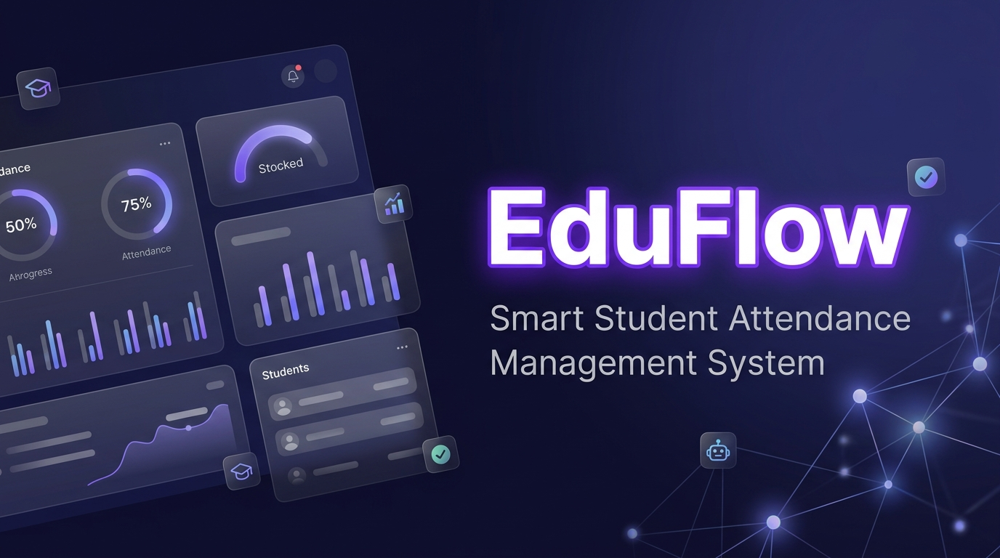

<div align="center">

  

  # 🎓 EduFlow — Smart Student Attendance Management System

  [](https://python.org)
  [](https://flask.palletsprojects.com/)
  [](https://www.sqlite.org/)
  [](https://openai.com/)
  [](LICENSE)

  **An AI-Powered, Feature-Rich Attendance Tracking & Predictive Analytics Platform for Educational Institutions**

</div>

---

## 🌟 Key Features

### 📊 1. Executive Dashboard & Analytics
- **Real-Time System Overview:** Instant view of total enrolled students, active subjects, average attendance rate, and shortage alerts.
- **Section & Subject Breakdowns:** Visual progress indicators and metric cards for quick administrative monitoring.
- **Interactive Visualizations:** Built-in charts powering intuitive performance trends.

### 📝 2. Seamless Attendance Marking
- **Batch Marking:** Easily mark daily attendance per subject, date, and section.
- **Toggle Controls:** Rapidly switch student status between **Present** and **Absent**.
- **Historical Attendance Log:** Comprehensive record tracking for past sessions with instant updates.

### 🤖 3. AI-Powered Assistant & Predictive Simulator
- **Natural Language Querying:** Ask questions like *"Which subjects am I struggling with?"* or *"Am I safe for exams?"* powered by OpenAI.
- **What-If Scenario Simulator:** Calculate predicted overall attendance percentages based on attending or missing the next $N$ upcoming classes.
- **Automated AI Insights:** Personalized summaries and risk advisories generated automatically for student profiles.

### 📋 4. Shortage Monitoring & Exportable Reports
- **Dynamic Threshold Filtering:** Identify students below custom threshold limits (e.g., `< 75%`).
- **Risk Categorization:** Real-time color-coded classification:
  - 🟢 **LOW Risk:** ≥ 85% Attendance
  - 🟡 **MEDIUM Risk:** 75% – 84.9% Attendance
  - 🟠 **HIGH Risk:** 60% – 74.9% Attendance
  - 🔴 **CRITICAL Risk:** < 60% Attendance
- **CSV Data Export:** One-click CSV generation for institution record-keeping and official notifications.

### 🔐 5. Role-Based Access Control (RBAC)
- **Admin:** Full access to manage students, subjects, attendance, AI diagnostics, and reports.
- **Teacher:** Mark attendance, manage subject lists, and review student progress reports.
- **Student:** Dedicated portal to track individual subject attendance, access AI guidance, and run What-If simulations.

---

## 🛠️ Tech Stack

| Component | Technology |
|---|---|
| **Backend Framework** | Flask 3.0.3 (Python 3.9+) |
| **Database & ORM** | SQLite3 & Flask-SQLAlchemy 3.1.1 |
| **Authentication** | Flask-Login 0.6.3 (Password Hashing via Werkzeug) |
| **Form Validation** | Flask-WTF & WTForms |
| **AI Integration** | OpenAI API (`gpt-4o-mini`) |
| **Frontend UI** | HTML5, Modern CSS3 (Glassmorphism & Custom Variables), JavaScript, Chart.js, FontAwesome Icons |

---

## 🚀 Getting Started

### 📋 Prerequisites
- **Python 3.9+** installed on your system.
- An **OpenAI API Key** (optional, required only for AI Assistant features).

### 🔧 Installation

1. **Clone the Repository:**
   ```bash
   git clone https://github.com/your-username/student-attendance-system.git
   cd student-attendance-system/attendance_system
   ```

2. **Create & Activate a Virtual Environment:**
   ```bash
   # Windows
   python -m venv .venv
   .venv\Scripts\activate

   # Linux / macOS
   python3 -m venv .venv
   source .venv/bin/activate
   ```

3. **Install Dependencies:**
   ```bash
   pip install -r requirements.txt
   ```

4. **Environment Configuration (`.env`):**
   Create a `.env` file inside the `attendance_system` folder:
   ```env
   SECRET_KEY=your_super_secret_key_here
   OPENAI_API_KEY=your_openai_api_key_here
   ```

5. **Run the Application:**
   ```bash
   python app.py
   ```

6. **Access the App:**
   Open your browser and navigate to `http://127.0.0.1:5000`

---

## 🔑 Demo Login Credentials

The system automatically seeds realistic demo data on initial launch:

| Role | Username | Password | Access Level |
|---|---|---|---|
| 👑 **Admin** | `admin` | `admin123` | Full System Management & System Reports |
| 🧑‍🏫 **Teacher** | `teacher` | `teacher123` | Attendance Marking, Student Overview |
| 🎓 **Student** | `student` | `student123` | Personal Dashboard & AI Simulator |

---

## 📁 Project Structure

```text
attendance_system/
├── app.py                  # Application entry point & demo data seeder
├── config.py               # Environment configuration settings
├── requirements.txt        # Python package dependencies
├── images/
│   └── banner.jpg          # GitHub README header banner
├── models/                 # SQLAlchemy database schemas
│   ├── attendance.py       # Attendance log model
│   ├── student.py          # User & Student profile models
│   └── subject.py          # Course subject model
├── routes/                 # Blueprint request handlers
│   ├── ai.py               # AI query & What-If endpoint handlers
│   ├── attendance.py       # Attendance creation & editing
│   ├── auth.py             # Login & session management
│   ├── main.py             # Dashboard views
│   ├── reports.py          # Attendance shortage & CSV export
│   └── students.py         # Student CRUD management
├── services/               # Business logic layer
│   ├── ai_service.py       # OpenAI prompt engineering & analysis
│   ├── attendance_service.py # Attendance calculations & logic
│   └── report_service.py   # Shortage queries & CSV formatter
├── static/                 # Static assets (CSS, JS, Fonts)
│   ├── css/style.css       # Custom modern responsive styling
│   └── js/main.js          # Interactive UI scripts
└── templates/              # Jinja2 HTML templates
    ├── base.html           # Master layout template
    ├── dashboard.html      # Main executive dashboard
    ├── ai_assistant.html   # AI bot & simulator view
    ├── mark_attendance.html# Attendance marking form
    ├── reports.html        # Shortage report page
    └── student_detail.html # Individual student breakdown
```

---

## 📄 License

Distributed under the MIT License. See `LICENSE` for details.

---

<div align="center">
  <sub>Built with ❤️ for Modern Educational Excellence</sub>
</div>
